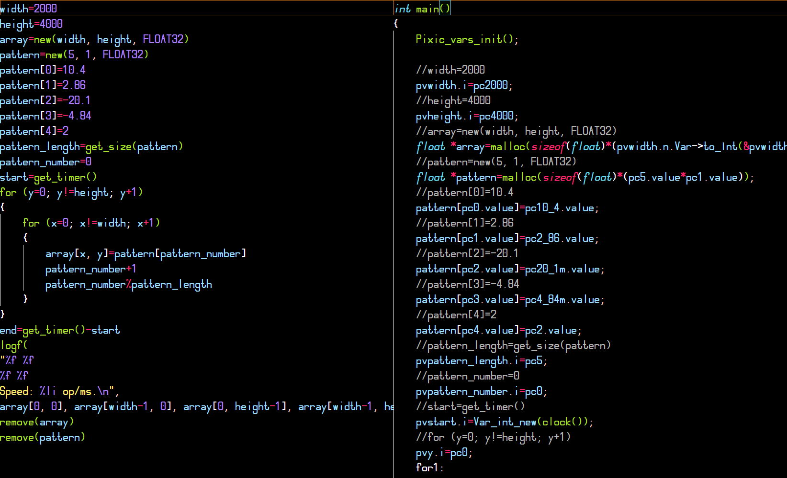

# **Pixic** - a Pixilang compiler.
[**Pixilang**](http://warmplace.ru/soft/pixilang) is very convinient programming language. You can easily and quickly make a graphical program or demoscene with this language. But it has low performance because of bytecode interpretation.\
With **Pixic** you can compile Pixilang code! This is made by translation of Pixilang code to C programming language, then translated code compiles to **native code**.\
Performance of Pixilang code compiled by Pixic increases above **2** times!\
Pixic is fully compatible with official version of Pixilang.\
*Enjoy pixi-experiments.*\

## In development. Not working yet.