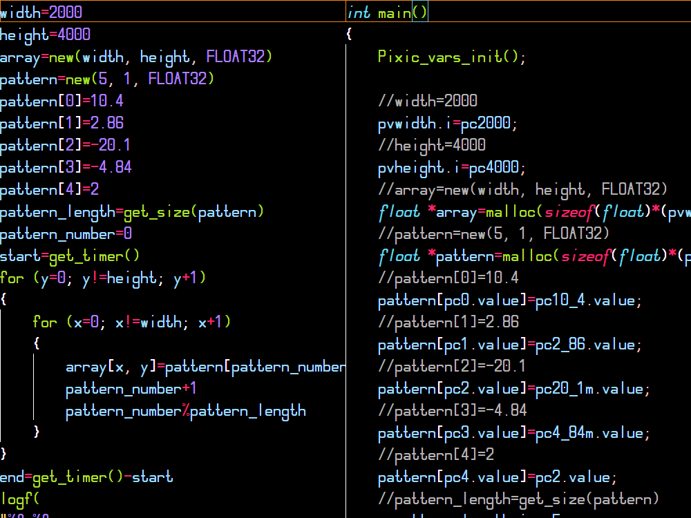

# **Pixic** - компилятор Pixilang.
[**Pixilang**](http://warmplace.ru/soft/pixilang) - очень удобный язык программирования. С его помощью можно легко и быстро написать графическое приложение или демосцену. Однако у этого языка недостаточная производительность из-за интерпретации байт-кода.\
С помощью **Pixic** вы сможете скомпилировать код языка Pixilang! Это делается путём трансляции кода Pixilang в код языка C с его последующей компиляцией в **машинный код**.\
Производительность кода Pixilang, скомпилированного с помощью Pixic, возрастает более чем в **2** раза!\
Pixic полностью совместим с официальной версией Pixilang.\
*Насладитесь pixi-экспериментами.*\

## На стадии разработки. Пока не работает.