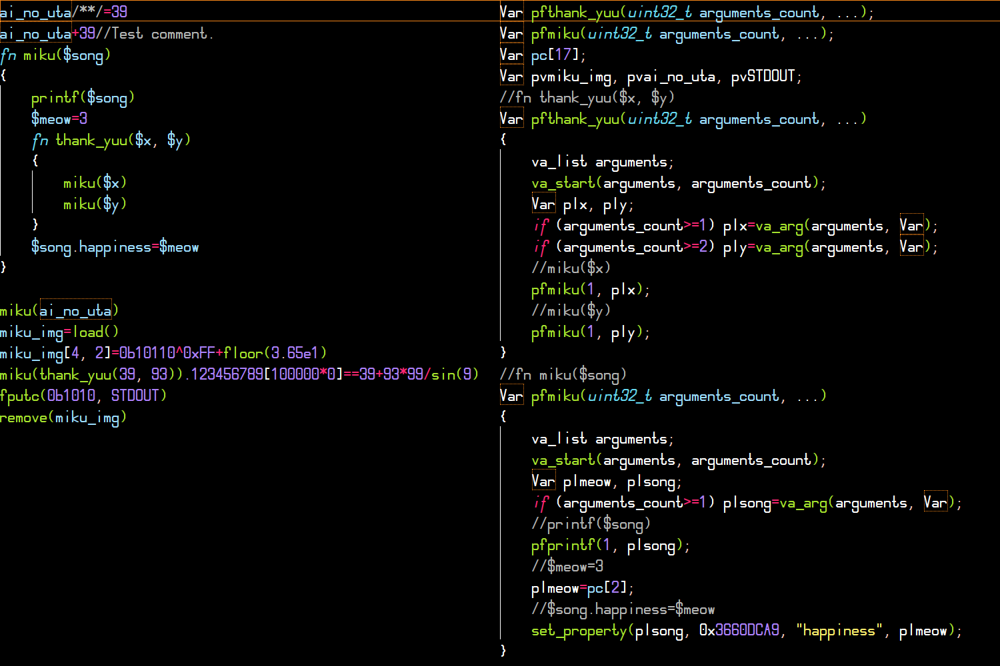

<!--
(C) 2022-2023 Серый MLGamer <Seriy-MLGamer@yandex.ru>

Этот файл - свободная документация: вы можете перераспространять его и/или изменять его на условиях лицензии Creative Commons Атрибуция-СохранениеУсловий 4.0 Всемирной: <https://creativecommons.org/licenses/by-sa/4.0/deed.ru>.
Этот файл распространяется в надежде, что он будет полезен, но БЕЗО ВСЯКИХ ГАРАНТИЙ; даже без неявной гарантии ТОВАРНОГО ВИДА или ПРИГОДНОСТИ ДЛЯ ОПРЕДЕЛЁННЫХ ЦЕЛЕЙ. Подробности смотрите в лицензии.
-->

# **Pixic** - компилятор Pixilang

[**Pixilang**](http://warmplace.ru/soft/pixilang/index_ru.php) - очень удобный язык программирования. С его помощью можно легко и быстро написать графическое приложение или демосцену. Однако у этого языка недостаточная производительность из-за интерпретации байт-кода.

С помощью **Pixic** вы сможете скомпилировать код, написанный на языке программиования Pixilang! Это делается путём трансляции кода на Pixilang в язык C с его последующей компиляцией в **машинный код**.

Производительность кода Pixilang, скомпилированного с помощью Pixic, возрастает более чем в **2** раза!

Pixic полностью совместим с официальной версией Pixilang.

# Лицензия

Pixic - свободная программа: вы можете перераспространять её и/или изменять её на условиях Стандартной общественной лицензии GNU в том виде, в каком она была опубликована Фондом свободного программного обеспечения; либо версии 3 лицензии, либо (по вашему выбору) любой более поздней версии.

Pixic распространяется в надежде, что он будет полезен, но БЕЗО ВСЯКИХ ГАРАНТИЙ; даже без неявной гарантии ТОВАРНОГО ВИДА или ПРИГОДНОСТИ ДЛЯ ОПРЕДЕЛЁННЫХ ЦЕЛЕЙ. Подробнее см. в Стандартной общественной лицензии GNU.

Вы должны были получить копию Стандартной общественной лицензии GNU вместе с этой программой. Если это не так, см. <https://www.gnu.org/licenses/>.

**Скорость - привилегия *свободных* Pixilang-программ!** Компилироваться с помощью Pixic и запускаться могут только свободные программы, так как библиотека *Pixic runtime*, необходимая для этого, распространяется по условиям не Меньшей, а обычной **Стандартной общественной лицензии GNU**. Остальные программы могут воспользоваться официальным интерпретатором Pixilang.

*Насладитесь pixi-экспериментами.*

# На стадии разработки. Но кое-что работает.

Теперь вы можете сгенерировать промежуточный файл на языке C, используя несколько поддерживаемых типов инструкций Pixilang:

* определение функции: `fn miku($song)`;
* вызов функции: `miku(ai_no_uta)`.

Они поддерживают следующие типы выражений:

* глобальная переменная: `ai_no_uta`;
* локальная переменная: `$song`;
* число (кроме цвета): `thank_yuu(39, 93)`;
* функция: `miku(thank_yuu(39, 93))`.

Переходите в папку "src/Pixic", и протестируйте это, запустив "test.sh" или "test.cmd" (но сначала вам нужно добавить Pixilang в переменную среды `PATH`). Сообщайте об ошибках, если вы нашли их, и запрашивайте вытягивание ваших коммитов в Pixic.